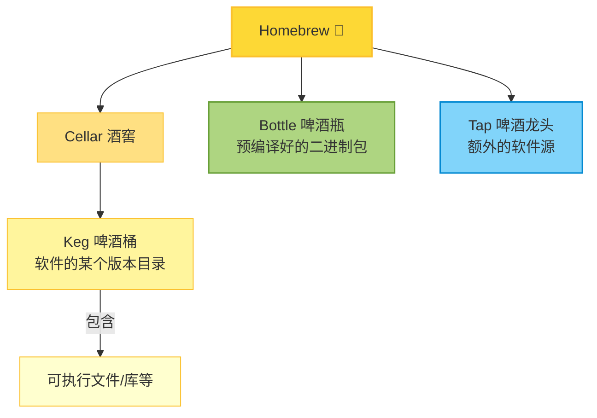

## Homebrew 中的 Keg

### 1. 什么是 Keg

* 每个 Homebrew 安装的软件包，都会放在 `Cellar` 目录下，比如：

  ```
  /opt/homebrew/Cellar/openjdk@17/17.0.11/
  ```
* 这个目录就是一个 **keg**，它包含了该版本软件的完整内容。
* 你可以把它理解成「某个版本的软件桶」。

### 2. 为什么叫 Keg？

Homebrew 的命名灵感来自酿酒 🍺：

* **Homebrew** = 家酿啤酒
* **Cellar** = 酒窖（所有酒桶存放的地方）
* **Keg** = 啤酒桶（一个软件包就是一桶）
* **Bottle** = 啤酒瓶（预编译好的二进制包）
* **Tap** = 啤酒龙头（额外的软件源）

所以：

* **Cellar** → 放着一桶桶酒（软件）
* **Keg** → 每一桶酒（一个软件包的某个版本）
* **Bottle** → 预装好的酒瓶（直接下载二进制，不用自己“酿”源码）

这就是 Homebrew 为啥用「keg」这个词。

### 3. Keg 在实际使用中的意义

* `brew install` 时，Homebrew 会在 `Cellar` 里创建一个 **keg**。
* Homebrew 默认会在 `/opt/homebrew/bin/` 里放一个 **symlink**，指向 keg 里的可执行文件。
  这样你就能直接用 `java`、`python` 等命令。
* 如果是 **keg-only**，那就是不自动建 symlink，你得手动配置 PATH 或 JAVA\_HOME。
* **keg = Cellar 里的某个具体软件版本目录**

### Homebrew 体系结构图



## 安装 Homebrew

[Homebrew国内如何自动安装（国内地址）](https://zhuanlan.zhihu.com/p/111014448)

执行以下命令，脚本会提示选择国内几个比较常用的镜像，选择中科大镜像然后一路安装即可。

```sh
/bin/zsh -c "$(curl -fsSL https://gitee.com/cunkai/HomebrewCN/raw/master/Homebrew.sh)"

# Set Homebrew-bottles mirror
export HOMEBREW_BOTTLE_DOMAIN=https://mirrors.ustc.edu.cn/homebrew-bottles
```

<!--more-->

## 查看 Homebrew 远程仓库 URL

```sh
# lists all currently tapped repositories.
brew tap

# Homebrew 源代码仓库
git -C "$(brew --repo)" remote -v

# Homebrew 核心软件仓库
git -C "$(brew --repo homebrew/core)" remote -v

# Homebrew cask 软件仓库，提供 macOS 应用和大型二进制文件
git -C "$(brew --repo homebrew/cask)" remote -v

# Homebrew cask 其他版本 (alternative versions) 软件仓库，提供使用人数多的、需要的版本不在 cask 仓库中的应用。
git -C "$(brew --repo homebrew/cask-versions)" remote -v
```

## Homebrew 使用代理

有时候镜像源中没有我们要安装的包，这时会从官方连接进行下载，速度依然较慢，此时可以使用代理进行下载，直接在终端设置代理即可。

```sh
export http_proxy=http://127.0.0.1:7890
export https_proxy=http://127.0.0.1:7890
export all_proxy=socks5://127.0.0.1:7891
```

## 手工设置 Homebrew 国内镜像源

如果需要手工设置国内镜像源，可以选择国内常用的有以下三大镜像源，

- [阿里云镜像](https://developer.aliyun.com/mirror/?lang=zh-CN)
- [清华大学镜像](https://mirrors.tuna.tsinghua.edu.cn)
- [中科大镜像](https://mirrors.ustc.edu.cn)

中科大镜像包含 `cask` 源，因此这里使用中科大做为镜像源。

[配置帮助](https://mirrors.ustc.edu.cn/help/brew.git.html)

```sh
# 替换 Homebrew (Homebrew 源代码仓库)
git -C "$(brew --repo)" remote set-url origin https://mirrors.ustc.edu.cn/brew.git

# 替换 Homebrew Core (Homebrew 核心软件仓库)
git -C "$(brew --repo homebrew/core)" remote set-url origin https://mirrors.ustc.edu.cn/homebrew-core.git


# 替换 Homebrew Cask (Homebrew Cask 软件仓库，提供 macOS 应用和大型二进制文件)
git -C "$(brew --repo homebrew/cask)" remote set-url origin https://mirrors.ustc.edu.cn/homebrew-cask.git

# 替换 Homebrew cask 其他版本 (alternative versions) 软件仓库，提供使用人数多的、需要的版本不在 cask 仓库中的应用。
brew tap --custom-remote --force-auto-update homebrew/cask-versions https://mirrors.ustc.edu.cn/homebrew-cask-versions.git

# Homebrew 预编译二进制软件包
echo 'export HOMEBREW_BOTTLE_DOMAIN=https://mirrors.ustc.edu.cn/homebrew-bottles' >> ~/.zshrc
source ~/.zshrc
```

### 恢复官方源

```sh
git -C "$(brew --repo)" remote set-url origin https://github.com/Homebrew/brew.git
git -C "$(brew --repo homebrew/core)" remote set-url origin https://github.com/Homebrew/homebrew-core.git
git -C "$(brew --repo homebrew/cask)" remote set-url origin https://github.com/Homebrew/homebrew-cask.git
brew tap --custom-remote --force-auto-update homebrew/cask-versions https://github.com/Homebrew/homebrew-cask-versions
```

## Homebrew 中的 keg-only formula

[Hard to understand what keg-only means](https://github.com/Homebrew/homebrew-core/issues/11091)

所有的 formula 都安装在 Cellar 中 (Cellar 路径: `brew --Cellar`)  
例如

```sh
/usr/local/Cellar/elasticsearch/5.2.2
/usr/local/Cellar/elasticsearch@1.7/1.7.6_1
```

所有 formula 都是 opt-linked (opt 路径)  
例如

```sh
/usr/local/opt/elasticsearch -> ../Cellar/elasticsearch/5.2.2
/usr/local/opt/elasticsearch@1.7 -> ../Cellar/elasticsearch@1.7/1.7.6_1
```

只有 non-keg-only 的 formula 才会软链接到 Homebrew prefix (`brew --prefix`)

```sh
/usr/local/bin/elasticsearch -> ../Cellar/elasticsearch/5.2.2/bin/elasticsearch
```

默认情况下，`/usr/local/bin` 会在你的 `PATH` 里，而下面的路径不在 `PATH` 里

```sh
(a) /usr/local/opt/elasticsearch/bin
(b) /usr/local/opt/elasticsearch@1.7/bin
```

对于路径 (a)，因为 `/usr/local/bin` 已经在 `PATH` 中，所以不会有问题，运行 `elasticsearch` 会执行 `/usr/local/bin/elasticsearch`，其指向 `/usr/local/Cellar/elasticsearch/5.2.2/bin/elasticsearch`。

对于路径 (b)，因为 `/usr/local/Cellar/elasticsearch@1.7/1.7.6_1/bin/elasticsearch` 没有软链接到 `/usr/local/bin`，你只能通过全路径来执行，或者将 `/usr/local/opt/elasticsearch@1.7/bin` 前置到 `PATH` 中。

之所以在 `PATH` 中前置 `/usr/local/opt/elasticsearch@1.7/bin` 而不是 `/usr/local/Cellar/elasticsearch@1.7/1.7.6_1/bin` 是因为如果你遇到修订版本到2 (比如 1.7.6_2) 或升级了小版本 (1.7.7)，`opt` 路径依然有效，而 `Cellar` 路径则必须更新到新的版本。

`opt` 路径对于 non-keg-only 的 formula 依然有效，但是 non-keg-only formula 一般都会软链接到 `/usr/local/bin`，且该路径已经在 `PATH` 中了，所以没必要使用 `opt` 路径。如果你 `brew unlink` 了一个 non-keg-only formula，那它就变成一个 keg-only formula，这时通过前置它的 `opt` 路径到 `PATH`，即使你 unlink 了它，你依然可以继续使用这个 formula。这在你安装两个有冲突的 non-keg-only 的 formula 时非常有用，你可以 unlink 其中一个来解决冲突。
