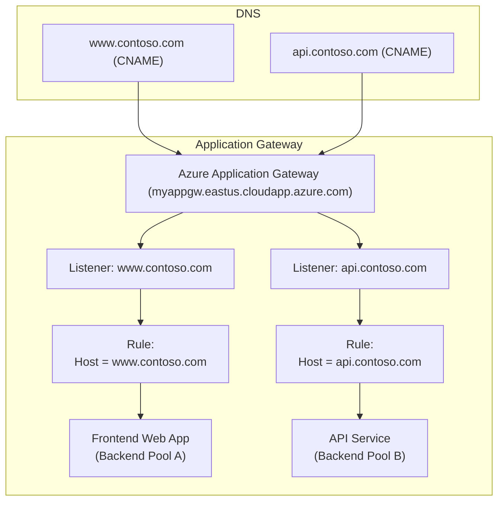

## 🔷 What Is a **VNet**?

An **Azure Virtual Network (VNet)** is the **top-level container** for your network resources in Azure. It provides **isolation**, **IP address space**, and **connectivity**.

### ✅ Purpose of VNet:

* Acts as your **private, isolated network** in Azure (like a virtual data center).
* Defines the **address space** using private IP ranges (e.g., `10.0.0.0/16`).
* Enables communication:

  * Between Azure resources
  * With on-premises networks (via VPN/ExpressRoute)
  * With the Internet (if configured)
* Provides the foundation for **routing**, **firewall**, and **NSG** rules.

<!--more-->

## 🔸 What Is a **Subnet**?

A **subnet** is a **subdivision of a VNet**. It allows you to **segment the VNet** into smaller address ranges to organize and secure resources.

### ✅ Purpose of Subnets:

* Divide the VNet IP space into **logical sections** (e.g., `10.0.1.0/24`, `10.0.2.0/24`).
* Group similar resources (e.g., web, app, database tiers) to apply different **security rules**.
* Assign **NSGs (Network Security Groups)** and **route tables** at the subnet level.
* Certain Azure services (like App Gateway, AKS, Bastion, etc.) require a **dedicated subnet**.
* Supports **delegation** to specific Azure services.

## 📊 Comparison Table

| Feature                | VNet                                       | Subnet                                            |
|------------------------|--------------------------------------------|---------------------------------------------------|
| **Definition**         | Top-level network in Azure                 | Subdivision of a VNet                             |
| **Purpose**            | Isolated private network environment       | Organize and secure resources inside VNet         |
| **Address Space**      | Defines full IP range (e.g., 10.0.0.0/16)  | Gets a subset of the VNet space                   |
| **Security**           | NSGs, route tables apply at VNet or subnet | NSGs and UDRs are often applied at subnet         |
| **Required For**       | Hosting any Azure networked resource       | Hosting actual resources (VMs, gateways)          |
| **Delegation Support** | Not supported                              | Yes, needed for services like AKS, App Service    |
| **Peering/Gateway**    | Configured at VNet level                   | Applied to specific subnets (e.g., GatewaySubnet) |

## 🧠 Analogy:

* **VNet** = Office Building
* **Subnets** = Rooms in the office (e.g., HR department, Server room)
* **NSG** = Security guard at the room door
* **Resources** = Employees or equipment inside rooms

## 🔐 Best Practices:

* Use **separate subnets** for different layers (Web, App, DB).
* Apply **NSGs at the subnet** level to enforce segmentation.
* Reserve a **GatewaySubnet** (named exactly) if using VPN or ExpressRoute.
* **Avoid overlapping address spaces** when peering or connecting VNets.

## Azure application gateway

### Multiple domains hosting (多域名托管)

