## Azure application gateway

Azure **Application Gateway** is a Layer 7 (application layer) **HTTP/HTTPS load balancer and reverse proxy** that provides **advanced traffic management** capabilities.

<!--more-->

### Functions

| Function                                       | Description                                                                               |
| ---------------------------------------------- | ----------------------------------------------------------------------------------------- |
| **Layer 7 Load Balancing**                     | Routes traffic based on HTTP(S) headers, URLs, cookies, etc.                              |
| **URL Path-Based Routing**                     | Routes requests to different backend pools based on URL paths (e.g., `/api/`, `/images/`) |
| **Host-Based Routing (Multi-site Hosting)**    | Routes based on domain name (e.g., `api.contoso.com`, `web.contoso.com`)                  |
| **Listener-level Certificate Binding** | Use different TLS certs per listener for multiple sites              |
| **TLS/SSL Termination**                | Decrypts SSL traffic at the gateway (offloads CPU from backends)     |
| **Web Application Firewall (WAF)**     | Protects against OWASP Top 10 vulnerabilities (e.g., SQLi, XSS)      |
| **Cookie-Based Affinity (Session Stickiness)** | Ensures a client stays on the same backend server using a gateway-managed cookie          |
| **Custom Probes**                              | Health checks with flexible configuration (e.g., path, status code, interval)             |

### 🚀 Application Gateway SKUs & Feature Differences

| SKU                    | Key Differences                                                 |
| ---------------------- | --------------------------------------------------------------- |
| **Standard v2**        | Modern, scalable, autoscaling, zone redundant                   |
| **WAF v2**             | Same as Standard v2 but includes Web Application Firewall       |
| **Standard (classic)** | Legacy SKU, lacks advanced features like autoscaling, rewriting |

### Overall diagram

```mermaid
graph TD
    subgraph AGW["Azure Application Gateway"]
        C1["🔓 SSL Termination"]
        C2["🛡️ WAF Inspection<br>(SQLi, XSS, DDoS)"]
        C3["↔️ Host-Based Routing<br>(e.g., api.contoso.com)"]
        C4["↔️ URL Path-Based Routing<br>(e.g., /images → VMSS, /api → AKS)"]
    end
    user[Internet User] -->|HTTPS Request| AGW
    AGW --> backendPool

    backendPool --> D1[Virtual Machines]
    backendPool --> D2[VM Scale Sets]
    backendPool --> D3[Azure Kubernetes Service]
    backendPool --> D4[Azure App Service]
```

### Multiple domains hosting (多域名托管)

