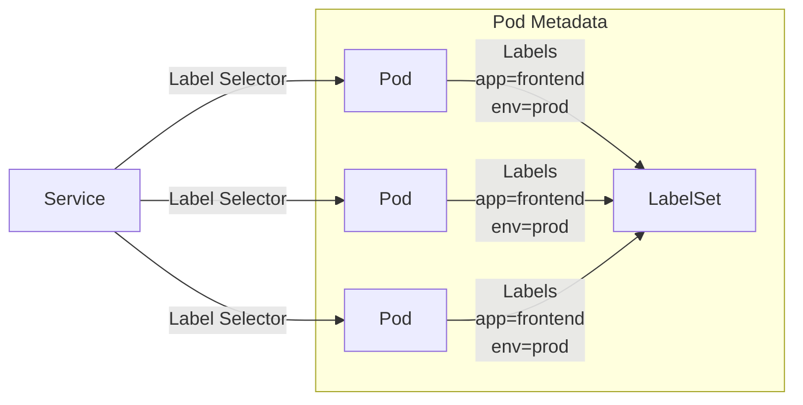
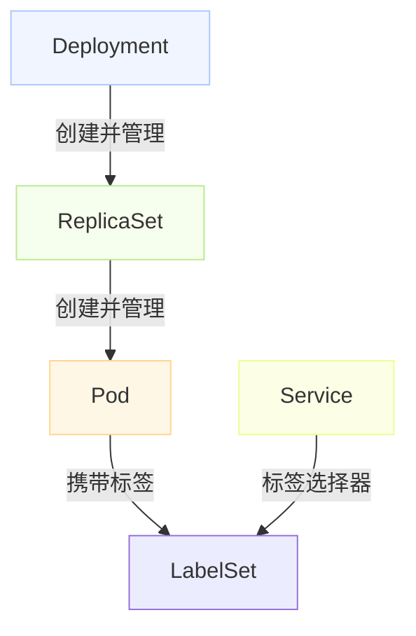
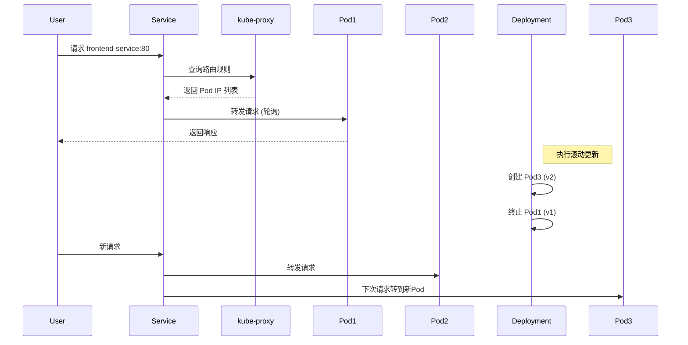

### Kubernetes Service 与 Pod 的关系

Service 与 Pod 的关系是 Kubernetes 网络模型的核心，通过**标签选择器(Label Selector)** 建立动态关联：



<!--more-->

#### 关键机制：

1. **标签匹配**：
   ```yaml
   # Service 定义
   apiVersion: v1
   kind: Service
   metadata:
     name: frontend-service
   spec:
     selector:           # 标签选择器
       app: frontend     # 匹配包含这些标签的 Pod
       env: prod
     ports:
       - protocol: TCP
         port: 80
         targetPort: 8080
   ```

2. **端点自动发现**：
   - Service 控制器持续监控 Pod 变化
   - 匹配标签的 Pod IP:Port 自动加入 Endpoints 对象
   ```bash
   kubectl get endpoints frontend-service
   # NAME                ENDPOINTS
   # frontend-service    10.1.0.1:8080,10.1.0.2:8080,10.1.0.3:8080
   ```

3. **负载均衡**：
   - 流量通过 kube-proxy 的 iptables/IPVS 规则分发
   - 自动过滤未就绪的 Pod（需配合 readinessProbe）

### Service 与 Deployment 的关系

**Service 不直接关联 Deployment**，而是通过 Pod 标签间接关联：



#### 协作流程：

1. **Deployment 创建 Pod**：
   ```yaml
   apiVersion: apps/v1
   kind: Deployment
   metadata:
     name: frontend-deployment
   spec:
     replicas: 3
     selector:
       matchLabels:
         app: frontend  # 必须匹配 template 中的标签
     template:
       metadata:
         labels:
           app: frontend  # Service 将匹配此标签
           env: prod
       spec:
         containers: [...]
   ```

2. **Service 发现 Pod**：
   - Deployment 创建的 Pod 带有 `app: frontend` 标签
   - Service 的 selector 匹配这些标签

3. **动态更新**：
   - 当 Deployment 滚动更新时：
     - 新 Pod 创建（带相同标签）→ 自动加入 Service
     - 旧 Pod 终止 → 自动从 Service 移除
   - 无需修改 Service 配置

### 三层抽象关系

| 资源 | 角色 | 生命周期 | 变更影响 |
|------|------|----------|----------|
| **Deployment** | 应用管理者 | 长期存在 | 控制 Pod 创建/销毁 |
| **Pod** | 运行实例 | 短暂易变 | IP 地址动态变化 |
| **Service** | 网络抽象 | 长期存在 | 屏蔽 Pod 变化 |

### 实际工作流示例



### 常见问题解答

**Q: Service 可以直接选择 Deployment 吗？**  
A: 不可以。Service 只能通过标签选择 Pod，Deployment 不直接暴露网络端点。

**Q: 如何确保 Service 关联正确的 Pod？**  
A: 标签匹配策略：

```yaml
# 精确匹配
selector:
  app: frontend
  tier: web

# 避免冲突的标签方案
app.kubernetes.io/name: frontend
app.kubernetes.io/instance: prod
```

**Q: Deployment 更新时流量如何切换？**  
A: 通过 readinessProbe 实现无损切换：

```yaml
readinessProbe:
  httpGet:
    path: /ready
    port: 8080
  initialDelaySeconds: 5
  periodSeconds: 2
```
- 新 Pod 就绪后才加入 Service
- 旧 Pod 在终止前继续服务

### 最佳实践

1. **标签命名规范**：
   ```yaml
   labels:
     app.kubernetes.io/name: frontend
     app.kubernetes.io/instance: prod-v1
     app.kubernetes.io/version: "1.2.0"
   ```

2. **服务发现方式**：
   - 集群内访问：`<service-name>.<namespace>.svc.cluster.local`
   - 环境变量注入：`FRONTEND_SERVICE_HOST`

3. **调试命令**：
   ```bash
   # 检查标签匹配
   kubectl get pods -l app=frontend

   # 检查端点状态
   kubectl describe service frontend-service

   # 检查服务 DNS
   kubectl run debug -it --rm --image=busybox --restart=Never -- nslookup frontend-service
   ```

4. **高级流量管理**：
   ```yaml
   # 金丝雀发布示例
   apiVersion: v1
   kind: Service
   metadata:
     name: main-service
   spec:
     selector:
       app: frontend
       version: v1.0  # 主要流量
   ---
   apiVersion: v1
   kind: Service
   metadata:
     name: canary-service
   spec:
     selector:
       app: frontend
       version: v2.0  # 少量流量
   ```

Service 作为稳定的网络抽象层，使 Deployment 可以自由地进行扩缩容和更新，而无需担心网络连接中断，这是 Kubernetes 弹性架构的关键设计。