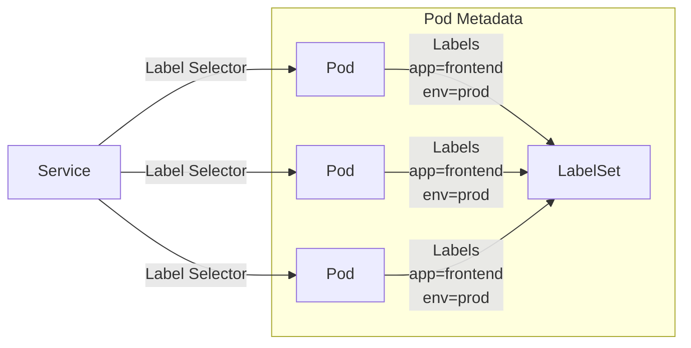
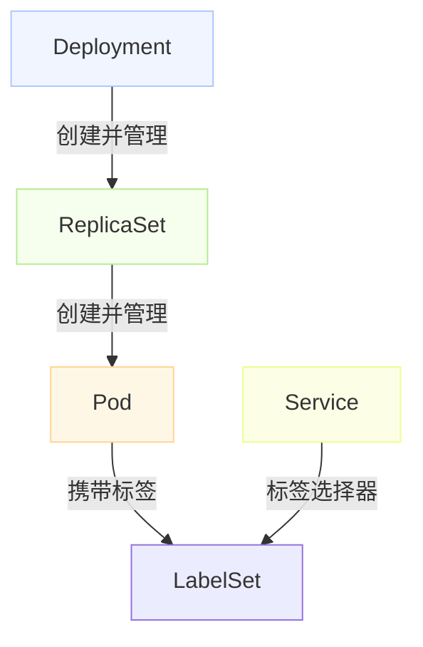
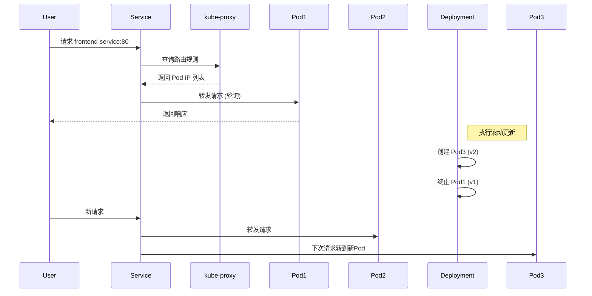
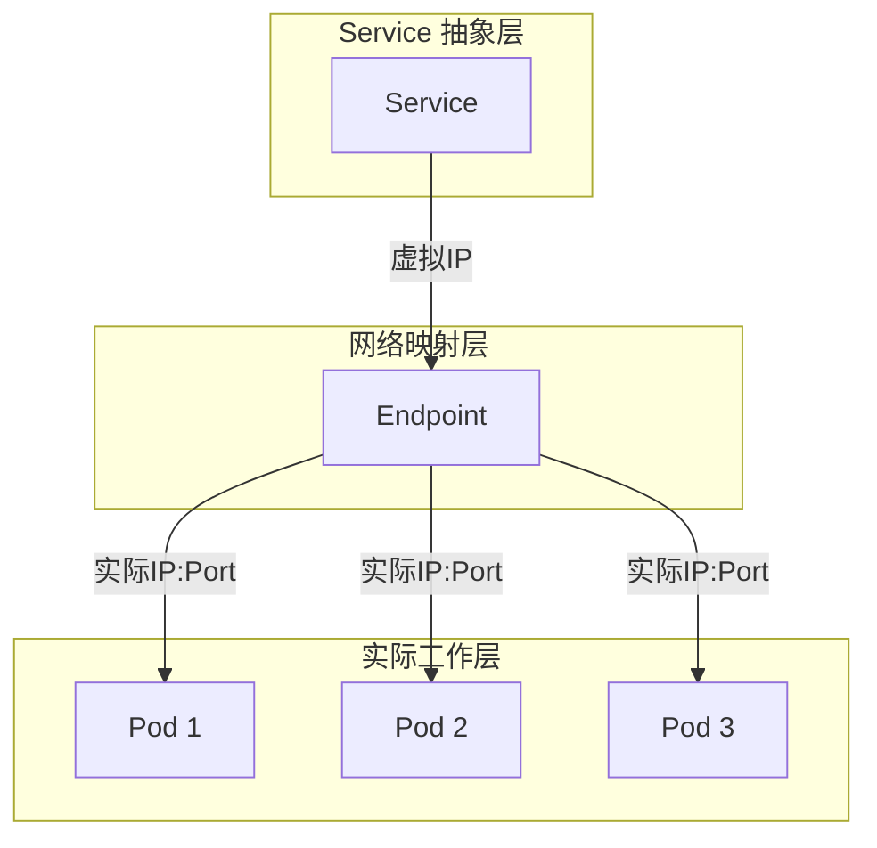
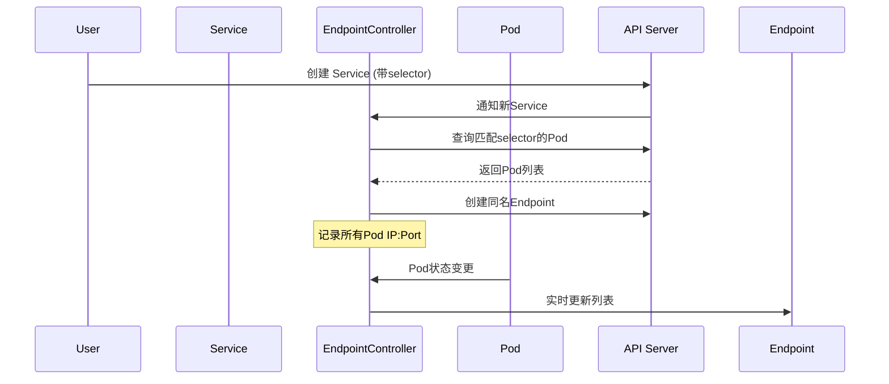
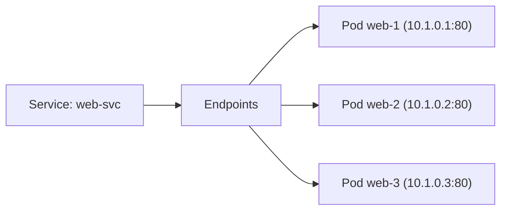
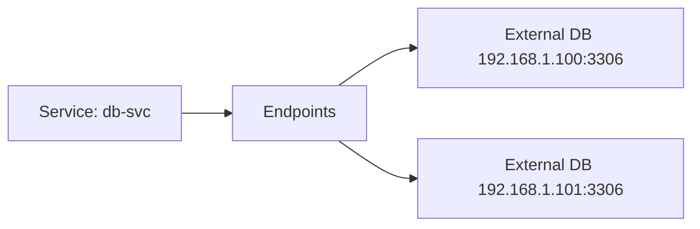
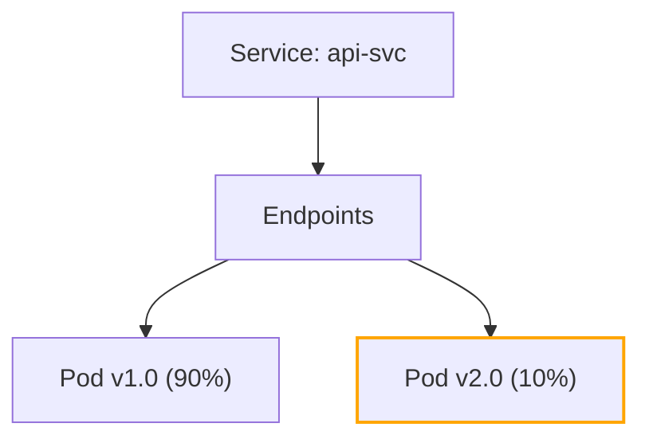
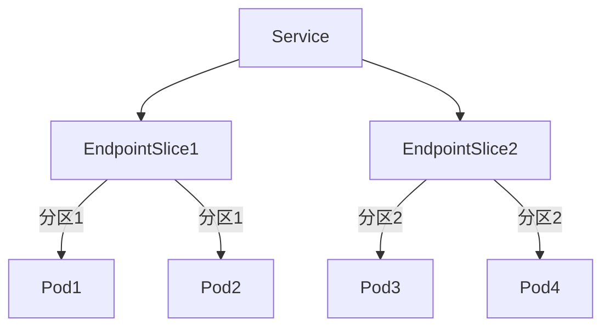

## Kubernetes Service 理解

### Kubernetes Service 与 Pod 的关系

Service 与 Pod 的关系是 Kubernetes 网络模型的核心，通过**标签选择器(Label Selector)** 建立动态关联：



<!--more-->

#### 关键机制：

1. **标签匹配**：
   ```yaml
   # Service 定义
   apiVersion: v1
   kind: Service
   metadata:
     name: frontend-service
   spec:
     selector:           # 标签选择器
       app: frontend     # 匹配包含这些标签的 Pod
       env: prod
     ports:
       - protocol: TCP
         port: 80
         targetPort: 8080
   ```

2. **端点自动发现**：
   - Service 控制器持续监控 Pod 变化
   - 匹配标签的 Pod IP:Port 自动加入 Endpoints 对象
   ```bash
   kubectl get endpoints frontend-service
   # NAME                ENDPOINTS
   # frontend-service    10.1.0.1:8080,10.1.0.2:8080,10.1.0.3:8080
   ```

3. **负载均衡**：
   - 流量通过 kube-proxy 的 iptables/IPVS 规则分发
   - 自动过滤未就绪的 Pod（需配合 readinessProbe）

### Service 与 Deployment 的关系

**Service 不直接关联 Deployment**，而是通过 Pod 标签间接关联：



#### 协作流程：

1. **Deployment 创建 Pod**：
   ```yaml
   apiVersion: apps/v1
   kind: Deployment
   metadata:
     name: frontend-deployment
   spec:
     replicas: 3
     selector:
       matchLabels:
         app: frontend  # 必须匹配 template 中的标签
     template:
       metadata:
         labels:
           app: frontend  # Service 将匹配此标签
           env: prod
       spec:
         containers: [...]
   ```

2. **Service 发现 Pod**：
   - Deployment 创建的 Pod 带有 `app: frontend` 标签
   - Service 的 selector 匹配这些标签

3. **动态更新**：
   - 当 Deployment 滚动更新时：
     - 新 Pod 创建（带相同标签）→ 自动加入 Service
     - 旧 Pod 终止 → 自动从 Service 移除
   - 无需修改 Service 配置

### 三层抽象关系

| 资源 | 角色 | 生命周期 | 变更影响 |
|------|------|----------|----------|
| **Deployment** | 应用管理者 | 长期存在 | 控制 Pod 创建/销毁 |
| **Pod** | 运行实例 | 短暂易变 | IP 地址动态变化 |
| **Service** | 网络抽象 | 长期存在 | 屏蔽 Pod 变化 |

### 实际工作流示例



### 常见问题解答

**Q: Service 可以直接选择 Deployment 吗？**  
A: 不可以。Service 只能通过标签选择 Pod，Deployment 不直接暴露网络端点。

**Q: 如何确保 Service 关联正确的 Pod？**  
A: 标签匹配策略：

```yaml
# 精确匹配
selector:
  app: frontend
  tier: web

# 避免冲突的标签方案
app.kubernetes.io/name: frontend
app.kubernetes.io/instance: prod
```

**Q: Deployment 更新时流量如何切换？**  
A: 通过 readinessProbe 实现无损切换：

```yaml
readinessProbe:
  httpGet:
    path: /ready
    port: 8080
  initialDelaySeconds: 5
  periodSeconds: 2
```
- 新 Pod 就绪后才加入 Service
- 旧 Pod 在终止前继续服务

### 最佳实践

1. **标签命名规范**：
   ```yaml
   labels:
     app.kubernetes.io/name: frontend
     app.kubernetes.io/instance: prod-v1
     app.kubernetes.io/version: "1.2.0"
   ```

2. **服务发现方式**：
   - 集群内访问：`<service-name>.<namespace>.svc.cluster.local`
   - 环境变量注入：`FRONTEND_SERVICE_HOST`

3. **调试命令**：
   ```bash
   # 检查标签匹配
   kubectl get pods -l app=frontend

   # 检查端点状态
   kubectl describe service frontend-service

   # 检查服务 DNS
   kubectl run debug -it --rm --image=busybox --restart=Never -- nslookup frontend-service
   ```

4. **高级流量管理**：
   ```yaml
   # 金丝雀发布示例
   apiVersion: v1
   kind: Service
   metadata:
     name: main-service
   spec:
     selector:
       app: frontend
       version: v1.0  # 主要流量
   ---
   apiVersion: v1
   kind: Service
   metadata:
     name: canary-service
   spec:
     selector:
       app: frontend
       version: v2.0  # 少量流量
   ```

Service 作为稳定的网络抽象层，使 Deployment 可以自由地进行扩缩容和更新，而无需担心网络连接中断，这是 Kubernetes 弹性架构的关键设计。

## Kubernetes Endpoint 理解

### Kubernetes Endpoint 解析

**Endpoint 是 Kubernetes 的核心网络抽象**，它是连接 Service 与实际 Pod 的关键桥梁。当您创建 Service 时，Kubernetes 会自动创建同名的 Endpoint 对象来动态跟踪后端 Pod。

#### 核心功能图解



#### Endpoint 的三大核心作用

1. **动态服务发现**  
   - 实时维护 Service 后端 Pod 的 IP:Port 列表
   - 自动更新 Pod 变化（创建/删除/迁移）

2. **健康状态跟踪**  
   - 基于 Pod 的 readinessProbe 过滤不可用端点
   - 确保流量只路由到健康的 Pod

3. **网络解耦中介**  
   - 隔离 Service（稳定虚拟IP）和 Pod（动态实体）
   - 实现零中断的滚动更新

---

### Endpoint 工作原理详解

#### 自动创建过程



#### 数据结构示例
```yaml
apiVersion: v1
kind: Endpoints
metadata:
  name: web-service  # 与Service同名
  namespace: default
subsets:
- addresses:
  - ip: 10.1.0.1     # Pod IP
    nodeName: node01
    targetRef:
      kind: Pod
      name: web-pod-1
  - ip: 10.1.0.2
    nodeName: node02
    targetRef:
      kind: Pod
      name: web-pod-2
  ports:
  - port: 8080       # 服务端口
    protocol: TCP
```

---

### 实际工作场景

#### 场景 1：标准 Service 后端


#### 场景 2：混合云架构（连接外部服务）

配置方法：
```yaml
# Service 无 selector
apiVersion: v1
kind: Service
metadata:
  name: external-db
spec:
  ports:
  - port: 3306
---
# 手动创建 Endpoints
apiVersion: v1
kind: Endpoints
metadata:
  name: external-db  # 必须与Service同名
subsets:
- addresses:
  - ip: 192.168.1.100
  - ip: 192.168.1.101
  ports:
  - port: 3306
```

#### 场景 3：金丝雀发布

Endpoint 自动调整流量权重：
1. 初始状态：10个 v1.0 Pod
2. 添加 2个 v2.0 Pod → 15%流量到新版本
3. 逐步减少 v1.0 Pod 数量

---

### Endpoint 与相关组件关系

| 组件 | 交互方式 | 关键作用 |
|------|----------|----------|
| **kube-proxy** | 监听 Endpoint 变化 | 更新 iptables/IPVS 规则 |
| **CoreDNS** | 为 Headless Service 提供 A 记录 | 直接返回 Endpoint 中的 IP |
| **Service** | 共享相同名称 | 提供虚拟 IP 到实际 Pod 的映射 |
| **kubelet** | 报告 Pod IP | 提供 Endpoint 的原始数据 |
| **EndpointSlice** | 新版本的 Endpoint | 解决大规模集群性能问题 |

---

### 高级特性：EndpointSlice

> Kubernetes v1.21+ 默认启用，解决大规模集群 Endpoint 性能瓶颈



**优势**：
- 单个 Service 支持最多 1000 个 EndpointSlice
- 每个 EndpointSlice 包含最多 100 个端点
- 并行处理提升性能
- 支持拓扑感知路由

---

### 关键操作命令

1. **查看 Endpoint 状态**：
   ```bash
   kubectl get endpoints <service-name>
   kubectl describe endpoints <service-name>
   ```

2. **调试 Endpoint 问题**：
   ```bash
   # 检查标签匹配
   kubectl get pods -l app=web-app
   
   # 检查就绪探针
   kubectl describe pod <pod-name> | grep Readiness
   
   # 验证网络连通性
   kubectl run debug -it --rm --image=nicolaka/netshoot -- curl http://<pod-ip>:<port>
   ```

3. **EndpointSlice 操作**：
   ```bash
   kubectl get endpointslice
   kubectl describe endpointslice <name>
   ```

---

### 常见问题解决方案

| 问题现象 | 根本原因 | 解决方案 |
|----------|----------|----------|
| Service 无可用端点 | ① Pod 标签不匹配<br>② Pod 未就绪 | 检查标签和 readinessProbe |
| 流量分配不均 | kube-proxy 模式问题 | 切换为 IPVS 模式 |
| Endpoint 更新延迟 | 控制器处理瓶颈 | 升级到 EndpointSlice |
| 外部服务连接失败 | 防火墙/网络策略 | 检查 NetworkPolicy |
| DNS 解析不稳定 | Headless Service 配置 | 验证 Endpoint 记录 |

> **最佳实践**：始终为 Pod 配置 readinessProbe，避免流量被发送到未就绪的 Pod，这是生产环境稳定的关键保障。