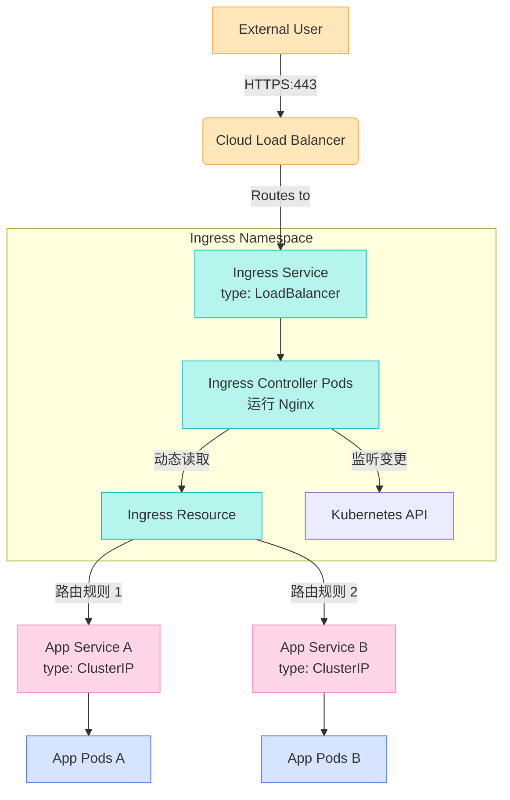

在 Kubernetes 中，Ingress 架构的精髓正是通过**单一入口点**管理所有入站流量，避免了为每个服务单独创建 LoadBalancer 的复杂性和成本。



<!--more-->

### 工作流程详解

1. **入口暴露**：
   ```mermaid
   sequenceDiagram
       User->>Cloud LB: 访问 https://app.example.com
       Cloud LB->>Ingress Service: 转发到 :443
       Ingress Service->>Ingress Pod: 负载均衡到 Pod
   ```

2. **路由决策**：
   ```mermaid
   sequenceDiagram
       Ingress Pod->>Kubernetes API: 查询匹配的 Ingress 规则
       Kubernetes API-->>Ingress Pod: 返回路由配置
       Ingress Pod->>Ingress Pod: 生成 Nginx 配置
       Note right of Ingress Pod: 规则示例：<br>app.example.com/api → api-service<br>app.example.com/ → web-service
   ```

3. **流量代理**：
   ```mermaid
   sequenceDiagram
       Ingress Pod->>App Service: 请求 api-service:8080
       App Service->>App Pods: 负载均衡到后端 Pod
       App Pods-->>Ingress Pod: 返回响应
       Ingress Pod-->>User: 通过 LB 返回结果
   ```

### Kubernetes Ingress 架构优点

1. **成本优化**：
   - 云厂商按 LoadBalancer 实例收费（如 AWS NLB $0.025/小时）

2. **端口管理**：
   - LoadBalancer 需要独占端口
   - Ingress 只需 80/443 即可服务所有应用

3. **统一安全控制**：
   ```mermaid
   graph LR
       Firewall -->|仅开放 443| Ingress
       Ingress -->|内部流量| ServiceA
       Ingress -->|内部流量| ServiceB
       style Firewall fill:#ffccc7,stroke:#ff4d4f
   ```

4. **简化 DNS 管理**：
   ```yaml
   # 所有服务共享同一入口
   *.example.com A记录 → 1个 LB IP
   ```

### 最佳实践配置示例

#### 1. Ingress Controller 部署

```yaml
# ingress-nginx-controller.yaml
apiVersion: apps/v1
kind: Deployment
metadata:
  name: nginx-ingress-controller
  namespace: ingress-nginx
spec:
  replicas: 2
  selector:
    matchLabels:
      app: ingress-nginx
  template:
    metadata:
      labels:
        app: ingress-nginx
    spec:
      containers:
      - name: controller
        image: k8s.gcr.io/ingress-nginx/controller:v1.8.1
        args:
          - /nginx-ingress-controller
          - --ingress-class=nginx
          - --configmap=$(POD_NAMESPACE)/nginx-configuration
```

#### 2. Ingress 服务暴露

```yaml
# ingress-service.yaml
apiVersion: v1
kind: Service
metadata:
  name: ingress-nginx
  namespace: ingress-nginx
spec:
  type: LoadBalancer
  selector:
    app: ingress-nginx
  ports:
    - name: http
      port: 80
      targetPort: 80
    - name: https
      port: 443
      targetPort: 443
```

#### 3. 应用路由规则

```yaml
# app-ingress.yaml
apiVersion: networking.k8s.io/v1
kind: Ingress
metadata:
  name: app-ingress
  annotations:
    nginx.ingress.kubernetes.io/rewrite-target: /
spec:
  ingressClassName: nginx
  rules:
  - host: app.example.com
    http:
      paths:
      - path: /api
        pathType: Prefix
        backend:
          service:
            name: api-service
            port:
              number: 8080
      - path: /
        pathType: Prefix
        backend:
          service:
            name: web-service
            port:
              number: 80
```

### Ingress Class Binding: Modern & Legacy Fields Overview

| Component              | Key Field / Arg                                                             | Value expected                     |
|------------------------|-----------------------------------------------------------------------------|------------------------------------|
| **IngressClass**       | `metadata.name`                                                             | `internal-nginx`                   |
|                        | `spec.controller`                                                           | `k8s.io/internal-ingress-nginx`    |
|                        | annotation `ingressclass.kubernetes.io/is-default-class` (optional)         | `"true"` for default class         |
| **Ingress Controller** | `--controller-class` flag                                                   | `k8s.io/internal-ingress-nginx`    |
|                        | `--ingress-class` flag                                                      | `internal-nginx`                   |
|                        | `--election-id` flag                                                        | e.g. `ingress-controller-internal` |
| **Ingress Resource**   | `spec.ingressClassName`                                                     | `internal-nginx`                   |
|                        | legacy annotation: `metadata.annotations.`**`kubernetes.io/ingress.class`** | `internal-nginx`                   |
