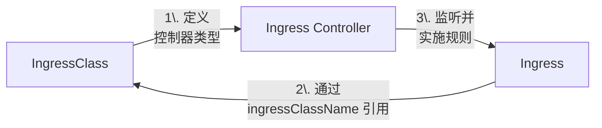
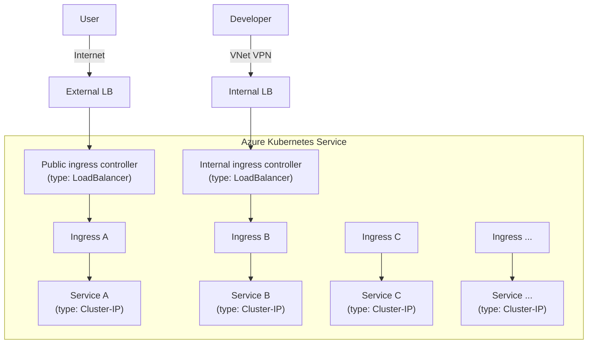

在 Kubernetes 中，Ingress 架构的精髓正是通过**单一入口点**管理所有入站流量，避免了为每个服务单独创建 LoadBalancer 的复杂性和成本。

<!--more-->


### 工作流程详解

1. **入口暴露**：
   ```mermaid
   sequenceDiagram
       User->>Cloud LB: 访问 https://app.example.com
       Cloud LB->>Ingress Service: 转发到 :443
       Ingress Service->>Ingress Pod: 负载均衡到 Pod
   ```

2. **路由决策**：
   ```mermaid
   sequenceDiagram
       Ingress Pod->>Kubernetes API: 查询匹配的 Ingress 规则
       Kubernetes API-->>Ingress Pod: 返回路由配置
       Ingress Pod->>Ingress Pod: 生成 Nginx 配置
       Note right of Ingress Pod: 规则示例：<br>app.example.com/api → api-service<br>app.example.com/ → web-service
   ```

3. **流量代理**：
   ```mermaid
   sequenceDiagram
       Ingress Pod->>App Service: 请求 api-service:8080
       App Service->>App Pods: 负载均衡到后端 Pod
       App Pods-->>Ingress Pod: 返回响应
       Ingress Pod-->>User: 通过 LB 返回结果
   ```

### Kubernetes Ingress 架构优点

1. **成本优化**：
   - 云厂商按 LoadBalancer 实例收费（如 AWS NLB $0.025/小时）

2. **端口管理**：
   - LoadBalancer 需要独占端口
   - Ingress 只需 80/443 即可服务所有应用

3. **统一安全控制**：
   ```mermaid
   graph LR
       Firewall -->|仅开放 443| Ingress
       Ingress -->|内部流量| ServiceA
       Ingress -->|内部流量| ServiceB
       style Firewall fill:#ffccc7,stroke:#ff4d4f
   ```

4. **简化 DNS 管理**：
   ```yaml
   # 所有服务共享同一入口
   *.example.com A记录 → 1个 LB IP
   ```

### 最佳实践配置示例

#### 1. Ingress Controller 部署

```yaml
# ingress-nginx-controller.yaml
apiVersion: apps/v1
kind: Deployment
metadata:
  name: nginx-ingress-controller
  namespace: ingress-nginx
spec:
  replicas: 2
  selector:
    matchLabels:
      app: ingress-nginx
  template:
    metadata:
      labels:
        app: ingress-nginx
    spec:
      containers:
      - name: controller
        image: k8s.gcr.io/ingress-nginx/controller:v1.8.1
        args:
          - /nginx-ingress-controller
          - --ingress-class=nginx
          - --configmap=$(POD_NAMESPACE)/nginx-configuration
```

#### 2. Ingress 服务暴露

```yaml
# ingress-service.yaml
apiVersion: v1
kind: Service
metadata:
  name: ingress-nginx
  namespace: ingress-nginx
spec:
  type: LoadBalancer
  selector:
    app: ingress-nginx
  ports:
    - name: http
      port: 80
      targetPort: 80
    - name: https
      port: 443
      targetPort: 443
```

#### 3. 应用路由规则

```yaml
# app-ingress.yaml
apiVersion: networking.k8s.io/v1
kind: Ingress
metadata:
  name: app-ingress
  annotations:
    nginx.ingress.kubernetes.io/rewrite-target: /
spec:
  ingressClassName: nginx
  rules:
  - host: app.example.com
    http:
      paths:
      - path: /api
        pathType: Prefix
        backend:
          service:
            name: api-service
            port:
              number: 8080
      - path: /
        pathType: Prefix
        backend:
          service:
            name: web-service
            port:
              number: 80
```

### Ingress Class Binding: Modern & Legacy Fields Overview

| Component              | Key Field / Arg                                                       | Value Expected                  |
|------------------------|-----------------------------------------------------------------------|---------------------------------|
| **IngressClass**       | `metadata.name`                                                       | `internal-nginx`                |
|                        | `spec.controller`                                                     | `k8s.io/internal-ingress-nginx` |
|                        | `ingressclass.kubernetes.io/is-default-class` annotation              | `"true"` (optional)             |
| **Ingress Controller** | `metadata.name`                                                       | `nginx-internal-controller`     |
|                        | `--controller-class` flag                                             | `k8s.io/internal-ingress-nginx` |
|                        | `--ingress-class` flag                                                | `internal-nginx`                |
|                        | `--election-id` flag                                                  | `ingress-controller-internal`   |
| **Ingress Resource**   | `spec.ingressClassName`                                               | `internal-nginx`                |
|                        | legacy annotation: `metadata.annotations.kubernetes.io/ingress.class` | `internal-nginx`                |



在 Kubernetes 中，**`IngressClass` 的主要作用是标识和管理特定类型的 Ingress Controller，并允许将 Ingress 资源路由到对应的 Controller 进行处理。** 它解决了在同一个集群中部署多个不同类型或实例的 Ingress Controller 时，如何明确指定哪个 Ingress 资源应该由哪个 Controller 管理的问题。

以下是 `IngressClass` 的核心作用和关键点：

1.  **解耦 Ingress 定义与控制器实现：**
    *   早期的 Ingress 资源（在 `networking.k8s.io/v1beta1` API 中）尝试直接在 `Ingress` 对象上通过 `kubernetes.io/ingress.class` 注解来指定控制器。这种方式不够正式且容易出错。
    *   `IngressClass` (正式引入于 `networking.k8s.io/v1` API) 提供了一个独立的、集群级别的资源来描述一种 *类型* 的 Ingress Controller（如 `nginx`, `traefik`, `haproxy`, `istio`, 或你自定义的控制器）。
    *   `Ingress` 资源通过 `spec.ingressClassName` 字段引用一个具体的 `IngressClass`，而不是直接硬编码控制器类型或配置细节。这实现了定义（Ingress）与实现（Controller）的分离。

2.  **支持多个并存的 Ingress Controller：**
    *   这是 `IngressClass` 最重要的应用场景。例如，你可能在同一个集群中同时运行：
        *   一个面向公网的 `nginx` Ingress Controller 处理用户流量。
        *   一个内部的 `traefik` Ingress Controller 处理服务网格或管理界面的流量。
    *   通过为每个 Controller 创建对应的 `IngressClass` (如 `ingress-class-public-nginx`, `ingress-class-internal-traefik`)，并在创建 `Ingress` 资源时指定相应的 `spec.ingressClassName`，你可以精确控制哪个 `Ingress` 规则由哪个 Controller 实例处理。

3.  **封装控制器特定的配置：**
    *   `IngressClass` 资源有一个 `spec.parameters` 字段。这个字段允许你提供特定于该类型 Ingress Controller 的配置。
    *   `parameters` 可以是一个指向另一个 Kubernetes 资源（通常是相同命名空间或集群范围的 CRD）的引用。例如：
        *   对于 Nginx Ingress Controller，你可以指向一个 `NginxIngress` 或 `IngressNginxConfig` 类型的自定义资源（如果 Controller 支持）。
        *   对于 AWS ALB Ingress Controller，你可以指向一个 `IngressClassParams` 资源来配置 ALB 属性（如 Scheme, IP 类型, Tags 等）。
    *   这样，Ingress 资源的定义 (`Ingress`) 可以保持通用，而控制器特有的、复杂的配置则通过 `IngressClass` 及其引用的 `parameters` 对象来管理，提高了 `Ingress` 资源的可移植性。

4.  **作为选择器供控制器使用：**
    *   Ingress Controller 在启动时通常会配置一个或多个 `--ingress-class` 参数（或类似的环境变量）。
    *   这个值应该与 `IngressClass` 资源的 `.metadata.name` 相匹配（例如 `nginx`）。
    *   控制器会监视集群：
        *   寻找与其配置的 `--ingress-class` 值匹配的 `IngressClass` 资源（确认自己负责处理该 Class）。
        *   寻找所有设置了 `spec.ingressClassName` 且其值等于该控制器所负责的 `IngressClass` 名称的 `Ingress` 资源。
    *   控制器**只处理**匹配其 `--ingress-class` 的 `IngressClass` 所关联的 `Ingress` 资源。忽略其他 `Ingress` 资源。

**总结比喻：**

可以把 `IngressClass` 想象成：

1.  **交通指示牌：** 告诉 `Ingress` 资源（道路规则）应该由哪个“交通警察”（Ingress Controller）来执行和维护。
2.  **配置包：** 为特定的“交通警察”携带一份详细的操作手册（控制器特定参数）。
3.  **分组标识符：** 在有多组“交通警察”负责不同区域（流量类型）的集群里，`IngressClass` 清晰地将 `Ingress` 规则分组，分派给对应的警察组。

**使用流程：**

1.  **部署 Ingress Controller：** 部署你的 Ingress Controller (e.g., Nginx, Traefik)，并配置其监听的 `--ingress-class` 值 (e.g., `my-nginx`, `internal-traefik`)。
2.  **创建 IngressClass 资源：** 创建一个 `IngressClass` 资源，将其 `.metadata.name` 设置为与 Controller 的 `--ingress-class` 匹配 (e.g., `my-nginx`)。
    ```yaml
    apiVersion: networking.k8s.io/v1
    kind: IngressClass
    metadata:
      name: my-nginx # 必须匹配Ingress Controller的 --ingress-class 参数
    spec:
      controller: k8s.io/nginx # 遵循 <可选的域名>/<ingress-controller名称> 的格式，标识控制器类型
      # parameters: ... (可选) 引用包含Nginx特定配置的对象
    ```
3.  **创建 Ingress 资源：** 在定义你的 `Ingress` 资源时，设置 `spec.ingressClassName` 字段为步骤 2 中 `IngressClass` 的名称 (e.g., `my-nginx`)。
    ```yaml
    apiVersion: networking.k8s.io/v1
    kind: Ingress
    metadata:
      name: my-app-ingress
    spec:
      ingressClassName: my-nginx # 指向上面创建的IngressClass
      rules:
      - host: myapp.example.com
        http:
          paths:
          - path: /
            pathType: Prefix
            backend:
              service:
                name: my-app-service
                port:
                  number: 80
    ```
4.  **控制器接管：** 配置了 `--ingress-class=my-nginx` 的 Nginx Ingress Controller 会检测到这个 `IngressClass` 和关联的 `Ingress` 资源，并据此配置其负载均衡器规则。其他 Controller (如配置了 `--ingress-class=internal-traefik` 的 Traefik) 会忽略这个 `Ingress`。

#### Ingress Diagram

