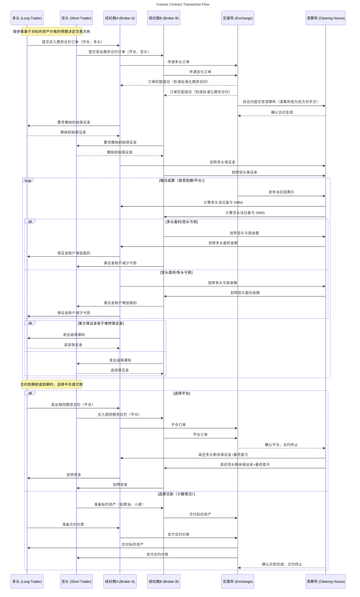

## Futures Contracts

**Futures contracts** are standardized agreements to buy or sell an underlying asset at a predetermined price at a specified time in the future. The transaction flow involves multiple parties, including traders, brokers, exchanges, and clearinghouses.

<!--more-->

### Futures Contract Transaction Flow

