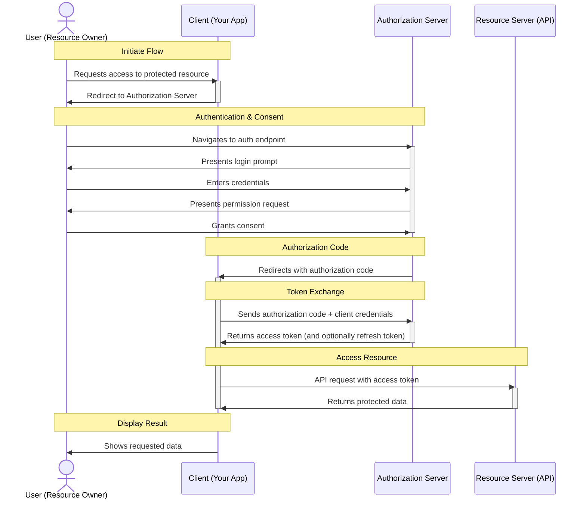

## OAUTH 2.0 Overview

**OAuth 2.0** is an **authorization framework** that enables third-party applications to obtain limited access to user accounts on an HTTP service, such as GitHub, or Google.

### Key Concepts

1. **Resource Owner**: The user who owns the data and grants access to it.
2. **Client**: The application requesting access to the resource owner's data.
3. **Authorization Server**: The server that authenticates the resource owner and issues access tokens to the client.
4. **Resource Server**: The server hosting the resource owner's data, which accepts access tokens to grant access.
5. **Access Token**: A token issued by the authorization server that the client uses to access the resource server.

<!--more-->

### Sequence of Events

