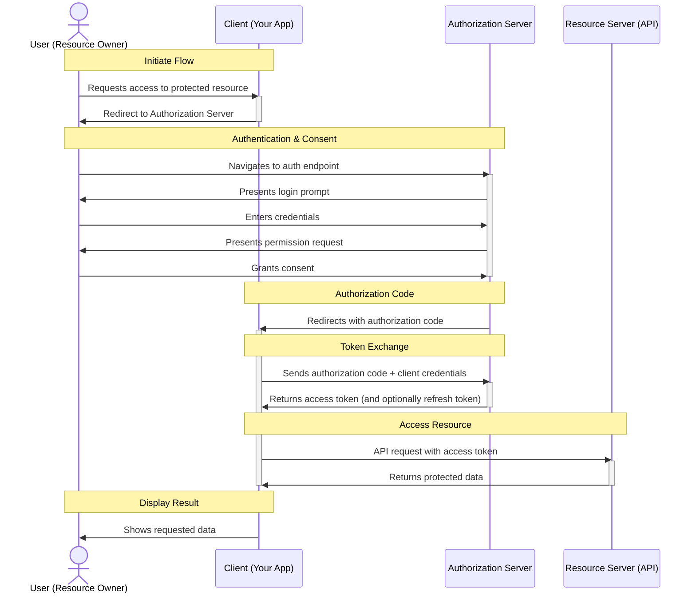
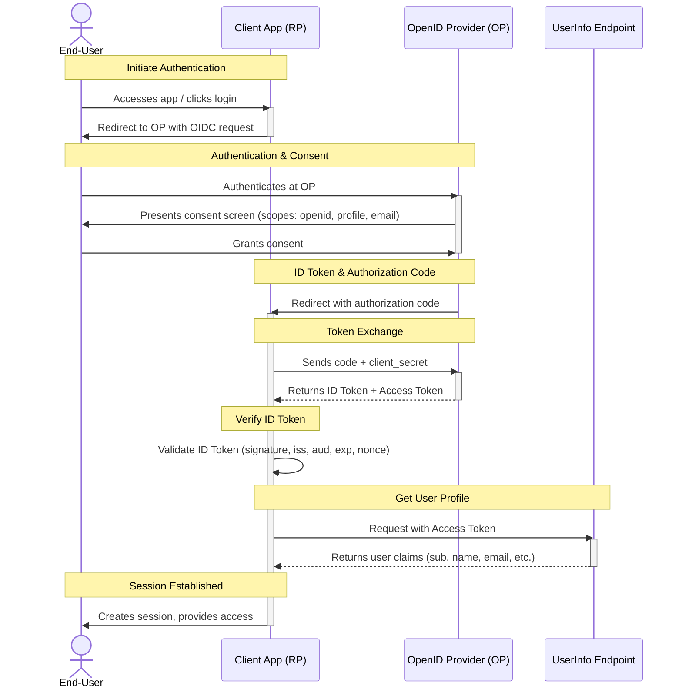

## OAUTH 2.0 Overview

**OAuth 2.0** is an **authorization framework** that enables third-party applications to obtain limited access to user accounts on an HTTP service, such as GitHub, or Google.

### Key Concepts

1. **Resource Owner**: The user who owns the data and grants access to it.
2. **Client**: The application requesting access to the resource owner's data.
3. **Authorization Server**: The server that authenticates the resource owner and issues access tokens to the client.
4. **Resource Server**: The server hosting the resource owner's data, which accepts access tokens to grant access.
5. **Access Token**: A token issued by the authorization server that the client uses to access the resource server.

<!--more-->

### Sequence of Events



## OpenID Connect (OIDC)

**OpenID Connect (OIDC)** is an authentication layer built on top of OAuth 2.0. While OAuth 2.0 is an *authorization* framework for delegated access to resources, OIDC adds *authentication* capabilities to verify user identities.

**Key Relationships**:
1. **Extension of OAuth 2.0**:  
   OIDC uses OAuth 2.0 flows but adds new tokens and endpoints for authentication.
2. **ID Token**:  
   Introduces a signed JSON Web Token (JWT) containing user identity claims.
3. **Standardized User Info**:  
   Defines a `UserInfo` endpoint to get user profile data.
4. **Authentication Semantics**:  
   Adds parameters like `openid` scope and `nonce` for security.

**OAuth 2.0 vs. OIDC**:
| Feature           | OAuth 2.0        | OpenID Connect (OIDC)            |
|-------------------|------------------|----------------------------------|
| **Purpose**       | Authorization    | Authentication + Identity        |
| **Tokens**        | Access Token     | ID Token + Access Token          |
| **User Info**     | Custom/undefined | Standardized `UserInfo` endpoint |
| **Core Artifact** | Access Token     | ID Token (JWT)                   |

### OpenID Connect Sequence Diagram (Authorization Code Flow)



### Key Components Explained:
1. **End-User**: 
   - Resource owner authenticating with the app

2. **Client App (Relying Party - RP)**:
   - Application requesting authentication
   - Must be registered with the OP

3. **OpenID Provider (OP)**:
   - Authorization Server + Identity Provider (e.g., Google, Auth0)
   - Hosts:
     - Authorization endpoint
     - Token endpoint
     - JWKS endpoint (for public keys)

4. **UserInfo Endpoint**:
   - Protected resource returning user claims
   - Requires valid access token

### Critical OIDC Elements:

- **ID Token** (JWT):  

  Contains verified claims about the user's authentication event. Example payload:
  ```json
  {
    "iss": "https://op.example.com",
    "sub": "248289761001",  // Unique user ID
    "aud": "client_id_123",
    "exp": 1311281970,
    "iat": 1311280970,
    "nonce": "n-0S6_WzA2Mj",
    "name": "Jane Doe",
    "email": "janedoe@example.com"
  }
  ```

- **Required Steps**:
  1. `nonce` parameter binding to prevent replay attacks
  2. ID Token signature verification using OP's public keys
  3. Validation of standard claims (`iss`, `aud`, `exp`, `iat`)

- **Scopes**:
  - `openid`: Required for OIDC flow
  - `profile`: Basic profile info (name, picture)
  - `email`: Email address
  - `offline_access`: Request refresh token

### Security Advantages:

1. **No Password Sharing**:  
   Users never enter credentials in the client app
2. **Verified Identity**:  
   Signed ID token provides cryptographic proof of authentication
3. **Standardized Claims**:  
   Interoperable user attributes across providers
4. **Session Management**:  
   Built-in mechanisms for logout and session revocation

OIDC transforms OAuth 2.0 from an authorization protocol into a complete authentication solution while maintaining compatibility with existing OAuth infrastructure.